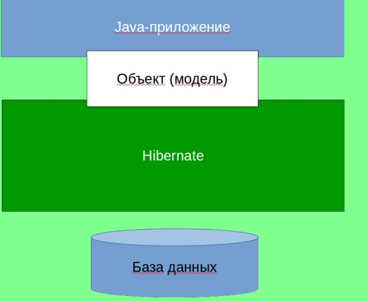
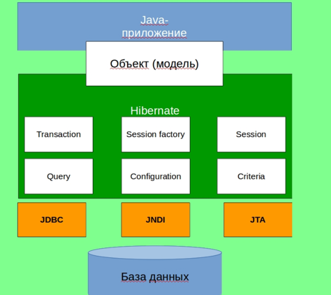

# ORM и Hibernate

## JDBC


Решение проблемы хранения данных существует - это реляционные системы управления базами данных.
Использование реляционной базы данных для хранения объектно-ориентированных данных приводит к семантическому разрыву,
заставляя программистов писать программное обеспечение, которое должно уметь обрабатывать данные в объектно-ориентированном виде, а хранить эти данные в реляционной форме.
Эта постоянная необходимость в преобразовании между двумя разными формами данных не только сильно снижает производительность,
но и создаёт трудности для программистов, так как обе формы данных накладывают ограничения друг на друга.

Реляционные базы данных используют набор таблиц, представляющих простые данные.
Дополнительная или связанная информация хранится в других таблицах.
Часто для хранения одного объекта в реляционной базе данных используется несколько таблиц;
это, в свою очередь, требует применения операции JOIN для получения всей информации, относящейся к объекту, для её обработки.
Например, для хранения данных записной книжки, скорее всего, будут использоваться как минимум две таблицы: люди и адреса, и, возможно, даже таблица с телефонными номерами.

Плюсы JDBC:
- Простая и понятная обработка SQL-запросов
- Крайне удобна для небольших приложений
- Простой и понятный синтаксис

Минусы JDBC:
- Сложно использовать и поддерживать в больших проектах
- Большое количество кода
- Сложно взаимодействовать с объектами Java


Допустим
```java

public class Developer {
private int id;
private String firstName;
private String lastName;
private String specialty;
private String salary;

    public Developer() {
    }

    public Developer(int id, String firstName, String lastName, String specialty, String salary) {
        this.id = id;
        this.firstName = firstName;
        this.lastName = lastName;
        this.specialty = specialty;
        this.salary = salary;
    }

    public int getId() {
        return id;
    }

    public void setId(int id) {
        this.id = id;
    }

    public String getFirstName() {
        return firstName;
    }

    public void setFirstName(String firstName) {
        this.firstName = firstName;
    }

    public String getLastName() {
        return lastName;
    }

    public void setLastName(String lastName) {
        this.lastName = lastName;
    }

    public String getSpecialty() {
        return specialty;
    }

    public void setSpecialty(String specialty) {
        this.specialty = specialty;
    }

    public String getSalary() {
        return salary;
    }

    public void setSalary(String salary) {
        this.salary = salary;
    }
}

```


И есть таблица в БД, которая также представляет разработчика:
```sql
create table HIBERNATE_DEVELOPERS (
id INT NOT NULL auto_increment,
first_name VARCHAR(50) default NULL,
last_name VARCHAR(50) default NULL,
specialty VARCHAR(50) default NULL,
salary INT default NULL,
PRIMARY KEY (id)
);
```

Допустим, что после того, как мы создали и java-класс и таблицу в БД, нам необходимо изменить нашу БД, у нас сразу же возникает проблема.
К тому же, когда мы записываем или читаем данные в/из БД, у нас есть 5 проблем, которые связаны с разницей между объект-ориентированной (далее – ОО) моделью и реляционной моделью:
- Наследование  - В реляционной модели нет никакого понятия, похожего на наследование, которое является одним из ключевых принципов ООП.
- Идентификация - Для БД есть только одна сущность, по которому объект может быть идентифицирован – это Первичный Ключ (Primary Key). В то время, как в Java у нас есть такие вещи, как (entity1 == entity2) и (object1.equals(object2)).
- Ассоциации - В Java мы используем ссылки на объекты для ассоциации, а в реляционной модели – Внешний Ключ (Foreign Key).
- Доступ  - В Java и в реляционной БД абсолютно разные способы получения доступа в объекту.

Отсюда возникает проблема: как сделать так, чтобы Java приложение получало доступ к БД и могло корректно интерпретировать эту информацию.
Другими словами, нам нужно создать связь между 
Объектом и реляционной сущностью, иначе говоря 
Объектно-Реляционное-Связывание или же – ORM (Object-Relational Mapping).


## ORM (Object Relational Mapping)?
ORM (Object-Relational Mapping) - это технология, которая позволяет отображать объекты и отношения между ними в объектно-ориентированных языках программирования на таблицы и связи между ними в реляционных базах данных. Она обеспечивает прозрачное взаимодействие между объектами программирования и структурой базы данных, автоматически генерируя и манипулируя SQL-запросами. ORM упрощает код приложений, делает его более универсальным и уменьшает вероятность появления ошибок, связанных с ручным написанием SQL-кода.

### Достоинства ORM
- Позволяет нашим бизнес методам обращаться не к БД, а к Java-классам - 
- Позволяет более быстро и удобно разрабатывать приложения
- Основан на JDBC 
- Отделяет SQL-запросы от ОО модели  
- Позволяет не думать о реализации БД
- Сущности основаны на бизнес-задачах, а не на стук туре БД 
- Управление транзакциями
- Позволяет обеспечить лучшую поддержку IDE

ORM состоит из:
- API, который реализует базовые операции (СОЗДАНИЕ, ЧТЕНИЕ,  ИЗМЕНЕНИЕ, УДАЛЕНИЕ) объектов-моделей.
- Средства настройки метаданных связывания
- Технику взаимодействия с транзакциями, которая позволяет реализовать такие функции, как dirty checking, lazy association fetching и т.д.

А самыми распространёнными ORM фреймворками для JAVA являются:
- Hibernate 
- EJB
- JDO
- Spring DAO


## Hibernate – это ORM фреймворк для Java с открытым исходным кодом. Эта технология является крайне мощной и имеет высокие показатели производительности.

Hibernate создаёт связь между таблицами в базе данных (далее – БД) и Java-классами и наоборот. 
Это избавляет разработчиков от огромного количества лишней, рутинной работы, в которой крайне легко допустить ошибку и крайне трудно потом её найти.

Hibirnate выступает прослойкой между Java объектами и взаимодействием с базой данных

Какие же преимущества даёт нам использование Hibernate?

- Обеспечивает простой API для записи и получения Java-объектов в/из БД.
- Минимизирует доступ к БД, используя стратегии fetching.
- Не требует сервера приложения.
- Позволяет нам не работать с типами данных языка SQL, а иметь дело с привычными нам типами данных Java.
- Заботится о создании связей между Java-классами и таблицами БД с помощью XML-файлов не внося изменения в программный код.
- Если нам необходимо изменить БД, то достаточно лишь внести изменения в XML-файлы.

Hibernate поддерживает все основные СУБД: MySQL, Oracle, PostgreSQL, Microsoft SQL Server Database, HSQL, DB2.


Архитектура

Базовая архитектура приложения на Hibernate имеет такую архитектуру:



Чуть более детальная архитектура:



#### Transaction

Этот объект представляет собой рабочую единицу работы с БД. В Hibernate транзакции обрабатываются менеджером транзакций.

### SessionFactory

Самый важный и самый тяжёлый объект (обычно создаётся в единственном экземпляре, при запуске приложения). Нам необходима как минимум одна SessionFactory для каждой БД, каждый из которых конфигурируется отдельным конфигурационным файлом.

#### Session

Сессия используется для получения физического соединения с БД.
Обычно, сессия создаётся при необходимости, а после этого закрывается. Это связано с тем, что эти объекты крайне легковесны. Чтобы понять, что это такое, что создание, чтение, изменение и удаление объектов происходит через объект Session.

#### Query

Этот объект использует HQL или SQL для чтения/записи данных из/в БД. Экземпляр запроса используется для связывания параметров запроса, ограничения количества результатов, которые будут возвращены и для выполнения запроса.

#### Configuration

Этот объект используется для создания объекта SessionFactory и конфигурирует сам Hibernate с помощью конфигурационного XML-файла, который объясняет, как обрабатывать объект Session.

#### Criteria

Используется для создания и выполнения объектно-ориентированного запроса для получения объектов.

### Конфигурирование
Для корректной работы, мы должны передать Hibernate подробную информацию, которая связывает наши Java-классы c таблицами в базе данных (далее – БД). 
Мы, также, должны укать значения определённых свойств Hibernate обычно, 
вся эта информация помещена в отдельный файл, либо XML-файл – hibernate.cfg.xml, либо – hibernate.properties.

В этой статье мы рассмотрим конфигурирование приложение с помощью XML-файла hibernate.cfg.xml.

Для начала рассмотрим ключевые свойства, которые должны быть настроены в типичном приложении:

- hibernate.dialect  Указывает Hibernate диалект БД. Hibernate, в свою очередь, генерирует необходимые SQL-запросы (например, org.hibernate.dialect.MySQLDialect, если мы используем MySQL).
- hibernate.connection-driver_class. Указывает класс JDBC драйвера.
- hibernate.connection.url - Указывает URL (ссылку) необходимой нам БД (например, jdbc:mysql://localhost:3306/database).
- hibernate.connection.username  Указывает имя пользователя БД (например, root).
- hibernate.connection.password Укащывает пароль к БД (например, password).
- hibernate.connection.pool_size Ограничивает количество соединений, которые находятся в пуле соединений Hibernate.
- hibernate.connection.autocommit Указывает режим autocommit для JDBC-соединения.

```xml
<!DOCTYPE hibernate-configuration PUBLIC
        "-//Hibernate/Hibernate Configuration DTD 3.0//EN"
        "http://www.hibernate.org/dtd/hibernate-configuration-3.0.dtd">
<hibernate-configuration>
    <session-factory>
        <!-- JDBC Database connection settings -->
        <property name="connection.driver_class">org.h2.Driver</property>
        <property name="connection.url">jdbc:h2:mem:test</property>
        <property name="connection.username">sa</property>
        <property name="connection.password"></property>
        <!-- JDBC connection pool settings ... using built-in test pool -->
        <property name="connection.pool_size">1</property>
        <!-- Select our SQL dialect -->
        <property name="dialect">org.hibernate.dialect.H2Dialect</property>
        <!-- Echo the SQL to stdout -->
        <property name="show_sql">true</property>
        <!-- Set the current session context -->
        <property name="current_session_context_class">thread</property>
        <!-- Drop and re-create the database schema on startup -->
        <property name="hbm2ddl.auto">create-drop</property>
        <!-- dbcp connection pool configuration -->
        <property name="hibernate.dbcp.initialSize">5</property>
        <property name="hibernate.dbcp.maxTotal">20</property>
        <property name="hibernate.dbcp.maxIdle">10</property>
        <property name="hibernate.dbcp.minIdle">5</property>
        <property name="hibernate.dbcp.maxWaitMillis">-1</property>
        <mapping class="Student" />
    </session-factory>
</hibernate-configuration>
```


### Сессии 
Сессия используется для получения физического соединения с базой данных (далее – БД).
Благодаря тому, что сессия является легковесны объектом, его создают (открывают сессию) каждый раз, когда возникает необходимость, а потом, когда необходимо, уничтожают (закрывают сессию). 
Мы создаём, читаем, редактируем и удаляем объекты с помощью сессий.
Мы стараемся создавать сессии при необходимости, а затем уничтожать их из-за того, что ни не являются потоко-защищёнными и не должны юыть открыты в течение длительного времени.
Экземпляр класса может находиться в одном из трёх состояний:

- transient Это новый экземпляр устойчивого класса, который не привязан к сессии и ещё не представлен в БД. Он не имеет значения, по которому может быть идентифицирован. 
- persistent Мы модем создать преходный экземпляр класса, связав его с сессией. Устойчивый экземпляр класса представлен в БД, а значение идентификатора связано с сессией. 
- detached После того, как сессия закрыта, экземпляр класса становится отдельным, независимым экземпляром класса.

```java
Session session = HibernateUtil.getSessionFactory().openSession())
import org.hibernate.SessionFactory;
import org.hibernate.boot.Metadata;
import org.hibernate.boot.MetadataSources;
import org.hibernate.boot.registry.StandardServiceRegistry;
import org.hibernate.boot.registry.StandardServiceRegistryBuilder;

public class HibernateUtil {
    private static StandardServiceRegistry registry;
    private static SessionFactory sessionFactory;

    public static SessionFactory getSessionFactory() {
        if (sessionFactory == null) {
            try {
                // Create registry
                registry = new StandardServiceRegistryBuilder().configure().build();

                // Create MetadataSources
                MetadataSources sources = new MetadataSources(registry);

                // Create Metadata
                Metadata metadata = sources.getMetadataBuilder().build();

                // Create SessionFactory
                sessionFactory = metadata.getSessionFactoryBuilder().build();

            } catch (Exception e) {
                e.printStackTrace();
                if (registry != null) {
                    StandardServiceRegistryBuilder.destroy(registry);
                }
            }
        }
        return sessionFactory;
    }

    public static void shutdown() {
        if (registry != null) {
            StandardServiceRegistryBuilder.destroy(registry);
        }
    }
}
```


Основные методы:
- Transaction beginTransaction() Начинает транзакцию и возвращает объект Transaction.
- void cancelQuery() Отменяет выполнение текущего запроса.

- void clear() Полностью очищает сессию
- Connection close() - Заканчивает сессию, осовождает JDBC-соединение и выполняет очистку.
- Criteria createCriteria(String entityName) Создание нового экземпляра Criteria для объекта с указанным именем.
- Criteria createCriteria(Class persistentClass) Создание нового экземпляра Criteria для указанного класса.
- Serializable getIdentifier(Object object) Возвращает идентификатор данной сущности, как сущности, связанной с данной сессией.
- void update(String entityName, Object object) Обновляет экземпляр с идентификатором, указанном в аргументе.
- void update(Object object) Обновляет экземпляр с идентификатором, указанном в аргументе.
- void saveOrUpdate(Object object) Сохраняет или обновляет указанный экземпляр.
- Serializable save(Object object) Сохраянет экземпляр, предварительно назначив сгенерированный идентификатор.
- boolean isOpen() Проверяет открыта ли сессия.
- boolean isDirty() Проверят, есть ли в данной сессии какие-либо изменения, которые должны быть синхронизованы с базой данных (далее – БД).
- boolean isConnected() Проверяет, подключена ли сессия в данный момент.
- Transaction getTransaction() - Получает связанную с этой сессией транзакцию.
- void refresh(Object object) - Обновляет состояние экземпляра из БД.
- SessionFactory getSessionFactory() -Возвращает фабрику сессий (SessionFactory), которая создала данную сессию.
- Session get(String entityName, Serializable id) - Возвращает сохранённый экземпляр с указанными именем сущности и идентификатором. Если таких сохранённых экземпляров нет – возвращает null.
- void delete(String entityName, Object object) Удаляет сохранённый экземпляр из БД.
- void delete(Object object) - Удаляет сохранённый экземпляр из БД.
- SQLQuery createSQLQuery(String queryString) Создаёт новый экземпляр SQL-запроса (SQLQuery) для данной SQL-строки. 
- Query createQuery(String queryString) Создаёт новый экземпляр запроса (Query) для данной HQL-строки. 
- Query createFilter(Object collection, String queryString) Создаёт новый экземпляр запроса (Query) для данной коллекции и фильтра-строки.

### Классы
Ключевая функция Hibernate заключается в том, что мы можем взять занчения из нашего Java-класса и сохранить их в таблице базы данных (далее – БД). 
С помощью конфигурационных файлов мы указываем Hibernate как извлечь данные из класса и соединить с определённым столбцами в таблице БД.
Если мы хотим, чтобы экземпляры (объекты) Java-класса в будущем сохранялся в таблице БД, то мы называем их “сохраняемые классы” (persistent class). 
Для того, чтобы сделать работу с Hibernate vаксимально удобной и эффективной, следует использовать программную модель  (Plain Old Java Object – POJO).
Сущесвуют определённые требования к POJO классам. Вот самые главные из них:
Все классы должны иметь ID для простой идентификации наших объектов в БД и в Hibernate. Это поле класса соединяется с первичным клюём (primary key) таблицы БД.
Все POJO – классы должны иметь конструктор по умолчанию (пустой).
Все поля POJO – классов должны иметь модификатор доступа private иметь набор getter-ов и setter-ов в стиле JavaBean.
POJO – классы не должны содержать бизнес-логику.

#### Аннотации 
Аннотации являются мощным иструментом  для предоставления метаданных, а также намного нагляднее при чтении нашего кода другим разработчиком.
- @Entity - Эта аннотация указывает Hibernate, что данный класс является сущностью (entity bean). Такой класс должен иметь конструктор по-умолчанию (пустой конструктор).
- @Table  - С помощью этой аннотации мы говорим Hibernate,  с какой именно таблицей необходимо связать (map) данный класс. Аннотация @Table имеет различные аттрибуты, с помощью которых мы можем указать имя таблицы, каталог, БД и уникальность столбцов в таблец БД.
- @Id - С помощью аннотации @Id мы указываем первичный ключ (Primary Key) данного класса.
- @GeneratedValue  - Эта аннотация используется вместе с аннотацией @Id и определяет такие паметры, как strategy и generator.
- @Column
- Аннотация @Column определяет к какому столбцу в таблице БД относится конкретное поле класса (аттрибут класса).
- Наиболее часто используемые аттрибуты аннотации @Column такие:
- name Указывает имя столбца в таблице
  unique Определяет, должно ли быть данное значение уникальным 
  nullable Определяет, может ли данное поле быть NULL, или нет. 
  length Указывает, какой размер столбца (например количество символов, при использовании String).
- @ManyToMany,OneToOne,OneToMany,ManyToOne


```java
import jakarta.persistence.*;

@Entity
@Table(name = "student")
public class Student {

    @Id
    @GeneratedValue(strategy = GenerationType.IDENTITY)
    @Column(name = "id")
    private int id;

    @Column(name = "first_name")
    private String firstName;

    @Column(name = "last_name")
    private String lastName;

    @Column(name = "email")
    private String email;

    public Student() {

    }

    public Student(String firstName, String lastName, String email) {
        this.firstName = firstName;
        this.lastName = lastName;
        this.email = email;
    }

    public int getId() {
        return id;
    }

    public void setId(int id) {
        this.id = id;
    }

    public String getFirstName() {
        return firstName;
    }

    public void setFirstName(String firstName) {
        this.firstName = firstName;
    }

    public String getLastName() {
        return lastName;
    }

    public void setLastName(String lastName) {
        this.lastName = lastName;
    }

    public String getEmail() {
        return email;
    }

    public void setEmail(String email) {
        this.email = email;
    }

    @Override
    public String toString() {
        return "Student [id=" + id + ", firstName=" + firstName + ", lastName=" + lastName + ", email=" + email + "]";
    }
}
```
### Cвязывание компонентов

Связи в ORM деляся на 3 гурппы:
- Связывание коллекций
- Ассоциативное связывание
- Связывание компоннетов


#### Связывание коллекций

Если среди значений класса есть коллекции  каких-либо значений, мы можем связать  их с помощью любого интерфейса коллекций, доступных в Java.

В Hibernate мы можем оперировать следующими коллекциями:
- java.util.List Связывается  с помощью элемента <list> и инициализируется с помощью java.util.ArrayList
- java.util.Collection  Связывается с помощью элементов <bag> или <ibag> и инициализируется с помощью java.util.ArrayList
- java.util.Set Связывается  с помощью элемента <set> и инициализируется с помощью java.util.HashSet
- java.util.SortedSet Связывается  с помощью элемента <set> и инициализируется с помощью java.util.TreeSet. В качестве параметра для сравнения может выбрать либо компаратор, либо естественный порядок.
- java.util.Map Связывается  с помощью элемента <map> и инициализируется с помощью java.util.HashMap.
- java.util.SortedMap Связывается  с помощью элемента <map> и инициализируется с помощью java.util.TreeMap. В качестве параметра для сравнения может выбрать либо компаратор, либо естественный порядок.


Связывание компонентов

Возможна ситуация, при которой наш Java – класс имеет ссылку на другой класс, как одну из переменных. 
Если класс, на который мы ссылаемся не имеет своего собственного жизненного цикла и полностью зависит от жизненного цикла класса, который на него ссылается, 
то класс, на который ссылаются называется классом Компонентом (Component Class).


### Пример App
```java
import java.util.List;

import org.hibernate.Session;
import org.hibernate.Transaction;


public class App {
    public static void main(String[] args) {

        Student student = new Student("iv", "des", "fd@uzum.com");
        Student student1 = new Student("das", "aa", "john@uzum.com");
        Transaction transaction = null;
        try (Session session = HibernateUtil.getSessionFactory().openSession()) {
            // start a transaction
            transaction = session.beginTransaction();
            // save the student objects
            session.save(student);
            session.save(student1);
            // commit transaction
            transaction.commit();
        } catch (Exception e) {
            if (transaction != null) {
                transaction.rollback();
            }
            e.printStackTrace();
        }

        try (Session session = HibernateUtil.getSessionFactory().openSession()) {
            List < Student > students = session.createQuery("from Student", Student.class).list();
            students.forEach(x->System.out.println(x.getFirstName()));
        } catch (Exception e) {
            if (transaction != null) {
                transaction.rollback();
            }
            e.printStackTrace();
        }
    }
}
```


# Эпилог
## Домашнее задание

Модифицировать [исходное приложение](project/pom.xml) таким образом, 
чтобы появились следующие сущности(если нужно, можно создавать другие сущности):
- Group(название группы, список студентов, которые находятся в группе, год выпуска)
- Course(содержит название курса, краткое описание курса, список групп, которые слушают этот курс)
Написать функцию, которая получает на вход название курса и возвращает список студентов, которые слушают этот курс. 
После этого поправить main, в нем  добавить студентов, курсы и группы, вызвать соответствующую функцию и вывести результат с помощью System.out.println
Дедлайн выполнения - 25 число. Результат необходимо разместить в своем гитхабе и приложить ссылку на степике.


## Основные ссылки 
- https://hibernate.org/
- https://habr.com/ru/articles/542328/